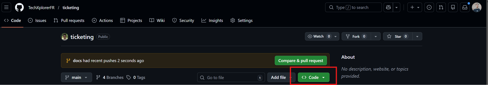

# README - Ticketing

## Description

Dans le cadre d'une évolution du service de notre entreprise, nous développons un module de gestion de tickets d'incident.
L’objectif est de permettre aux utilisateurs de créer, consulter et suivre des tickets, et aux
techniciens de les mettre à jour ou clôturer.

## Installation

Afin d'installer notre projet sur votre machine, vous devez cloner le repo GitHub. Pour ce faire aller sur le [repo](https://github.com/TechXplorerFR/ticketing) puis clicker sur le bouton code vert.



Une fois fais, ouvrez un terminal et créer un dossier pour y mettre le projet :

```bash
mkdir ticketing
cd ticketing
```

Ensuite, cloner le repo localement :

```bash
git clone https://github.com/TechXplorerFR/ticketing
```

Puis y accéder avec la ligne suivante :

```bash
code .
```

Vous avez maintenant accès au projet depuis votre appareil en local. Il vous reste désormais à télécharger les modules et extensions nécessaires pour pouvoir travailler dessus.

Vous aurez besoin des suivant :

| Nom     | Version Minimum | Lien de téléchargement                               |
| ------- | --------------- | ---------------------------------------------------- |
| Node.js | v20.19+         | <https://nodejs.org/en/download>                     |
| npm     | v7+             | <https://docs.npmjs.com/cli/v8/commands/npm-install> |

Vous pouvez les télécharger à la fois dans le dossier ``backend`` et dans le dossier ``frontend``.

Voici les lignes de codes nécessaire :

```bash
cd src/frontend
npm i
cd ../backend
npm i
```

Vous êtes maintenant prêt à vous lancer sur le projet, n'oubliez pas de passer par la section [contributing](#contributing) avant de commencer.

## Usage

_Création de ticket_ :

A DEFINIR

_Assigner un ticket_ :

A DEFINIR

_Assigner une priorité à un ticket_ :

A DEFINIR

_Changer l'état d'un ticket_ :

A DEFINIR

_Consulter ses tickets_ :

A DEFINIR

## Bugs Connus

Aucun bug connu recensé à ce jour. Vous pourrez les trouver dans l'onglet [Issues](https://github.com/TechXplorerFR/ticketing/issues) une fois qu'il y en aura.

## Versionning

Vous pouvez retrouver les différentes version dans l'onglet [déploiement](https://github.com/TechXplorerFR/ticketing/releases) de GitHub.

Version actuelle : v0.0.0
Latest version : v0.0.0
Latest stable version : null

## Contributing

Pour contribuer à notre projet vous pouvez regarder nos [Instructions de contribution](./CONTRIBUTING.md).

## Licence

Ce projet n'a pas de licence particulière.
